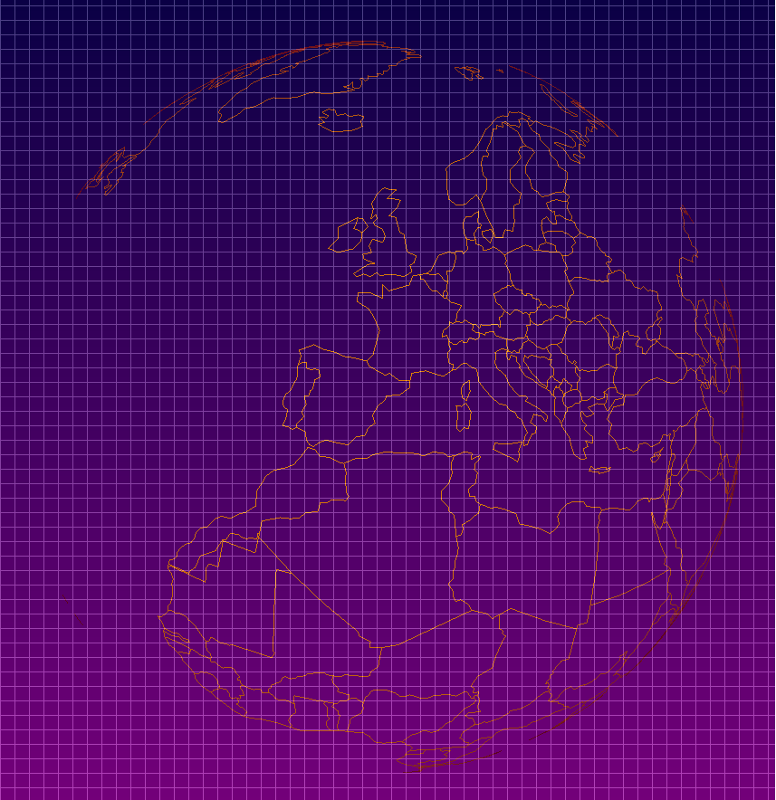
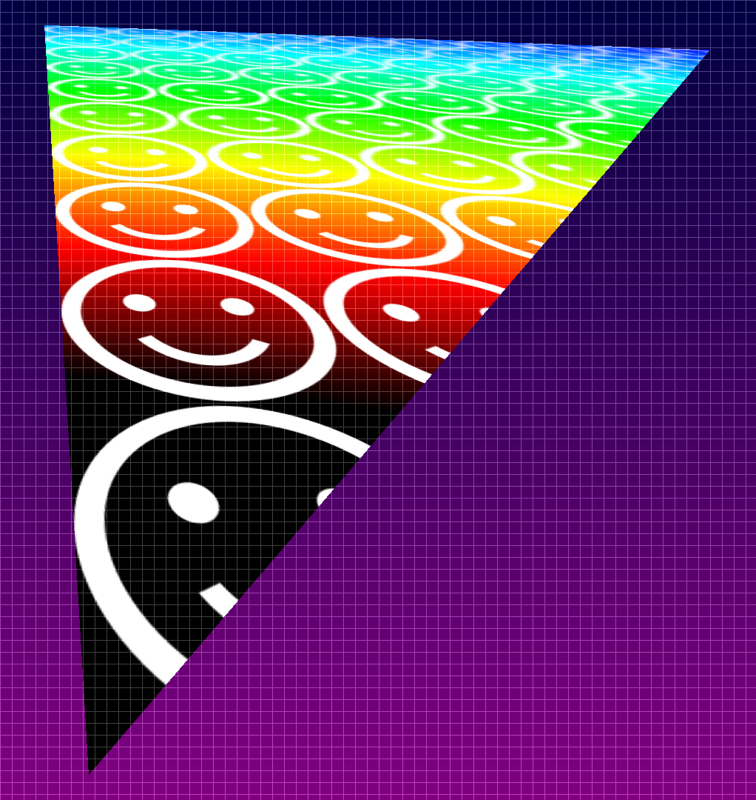
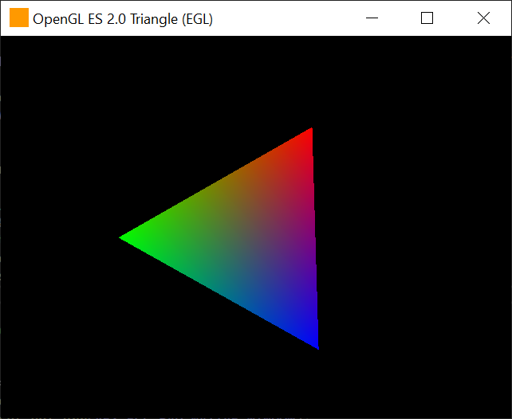

# Aex-GL - an OpenGL ES 2.0 implementation in software

Aex-GL is an OpenGL ES 2.0 implementation with no dependencies, it is useful in headless and/or static linking configurations where
performance is not of the utmost priority (software rendering.) It is currently under development.

Aex-GL is licensed under version 2 of the Apache Software License.

## Current Status

Aex-GL is currently under development, so expect bugs, and consider it immature until further notice. 
It should not be used for security sensitive areas (e.g. web browsers or such). 

Implemented are:
* vertex and fragment shader compilation and execution at GLSL 1.00 level, 
* 32 bit RGBA framebuffer
* 16 bit stencil buffering, 
* 16 and 32 bit depth buffering, 
* all blending modes, 
* lines, and triangles
* dFdx(), dFdy(), fwidth(), while these are strictly not in GLSL 1.00, they impact the rasterization in a very fundamental way. This makes
  them difficult to add later, hence implementing them now.

Missing are:
* points (GL_POINT) - note however GL_LINES are implemented.
* MSAA - this is currently not targeted. 

It is still in development, so as mentioned, expect bugs. Should you try it out, please report any problems by raising an issue.

## Performance

Aex-GL is a software implementation of a renderer, that does not perform JIT compilation but executes its shaders out of their ASTs. 
Yet it is faster than you might otherwise expect because of its architecture (the shader execution is amortized over many pixels and
the compiler is very much "encouraged" to auto-vectorize by breaking down operations into bundles of as simple as possible loops
(feel free to have a rummage around in [sl_execution.c](src/sl_execution.c) or [builtins.c](src/builtins.c) to develop a sense.)

## Pictures

Here are a few pictures rendered with Aex-GL.

### GTA3 His hands are all messed up

GTA3 makes for such a great development target, running on OpenGL ES 2.0, so it only makes sense to share a development image.

GTA3 is beginning to look better and better. Recent fixes have in particular improved the lighting. To get the re3 GTA3 code base to 
pick up the OpenGL ES 2.0 DLLs, you'll need to make a change [^1] in how it drives GLFW (otherwise it'll still pick up Windows'
OpenGL, even if you specify OpenGL ES 2.0), feel free to reach out for instructions. 
I'm not sure what Rockstar thinks of re3 itself (the project suddenly went quiet but the code is still out there) so I can't help there, 
but it sure makes for such a great test case.

### The World is Yours

If you happen to know me, you might recognize this from [firecrest.com](https://firecrest.com/) ; the data is from [naturalearthdata.com](https://naturalearthdata.com)
and the code is a relatively straight port from the original `.js` (feel free to compare the two, view the source at [firecrest.com](https://firecrest.com/) 
and compare it with [demo_the_world_is_yours.c](/renderbmp/demo_the_world_is_yours.c)

Suppose we compile everything at every frame, then, on my local machine, this runs 1080p at 35285 &mu;secs (or ~ 28fps.) Each line segment is 
composed of two points, of which there are 21172. Given that each line segment decomposes into 4 triangles, for about 40K triangles
in total, the current performance is surprisingly good (even ~50fps on the laptop..) Apologies for viewers from the Americas or Asia,
but, as mentioned, this uses naturalearthdata.com, and a longitude of 0 happens to intersect Greenwich. You can see it spinning at
[firecrest.com](https://firecrest.com/).

### Trilinear mipmapped triangle

Can't remember where I first saw a colorplate like this (early opengl, or foley & van dam, old stuff) but it's a standard
triangle test where the texture has been deliberately messed with to test mipmapping.

So, again, compiling everything at every frame, then, on the local machine, this runs 1080p at 74878 &mu;secs (or ~ 13 fps.) This is a lot
slower because the texture mapping currently does not yet benefit from autovectorized parallelization (need it to hit the feature-set
first, before we make it faster.)

### GLFW triangle-opengles demo

While static linkage is one of the primary targets, the build on windows will also emit EGL.dll and GLESv2.dll to allow for easier
integration. One of these integration targets is [GLFW](https://www.glfw.org/), an Open Source, multi-platform library for OpenGL, OpenGL 
ES and Vulkan development on the desktop. The nice thing about GLFW is it has a few demos to test with:

This is an early stage of that integration, and shows Aex-GL running the spinning triangle demo that ships with GLFW. To run this
yourself, build Aex-GL, copy over the AexGL.dll, EGL.dll and GLESv2.dll's from the build directory to the directory with the 
triangle-opengles executable, and you should be good. But, beware! EGL support is currently very limited and under development; just 
enough duct tape to get this going for now.

# The parser

If you came from [Carburetta.com](https://carburetta.com/) and just want to see the parsing side of the business: parsing occurs
in roughly two stages:
1. Preprocessor - this is a standard C99 preprocessor, it will still need fine-tuning to make it specific to GLSL. Because (like in C)
   the preprocessor also does the tokenization, some additions have been made to support the GLSL specific tokens.
2. The GLSL parser - given tokens from the preprocessor, parses the GLSL language in a relatively straightforward manner.

## Preprocessor

The preprocessor consists of six Carburetta parsers which, configured in a pipelined fashion, handle the translation phases. In 
chronological order:
* *Trigraphs* [pp_trigraphs.cbrt](src/pp/pp_trigraphs.cbrt) handles the tri-graph sequences (e.g. `??=` is converted into `#` and
  so on.)
* *Line Continuations* [pp_line_continuations.cbrt](src/pp/line_continuations.cbrt) handles the line continuations (e.g. lines ending
  with `\` have the next line concatenated to them, rather than starting a new line. Note that, because this follows the trigraph
  processing, you could end a line with `??/` and expect that to work.)
* *Tokenization* [pp_tokenizer.cbrt](src/pp/pp_tokenizer.cbrt) converts text into tokens. From here on out, with only a few exceptions
  (e.g. only exotic parts of macro expansions come to mind), the rest of the parsers work with tokens and we leave text behind. Some
  parts of the compiler has a different idea about what type of token a given token is than others, these translations are contained
  in a large table in [pp_tokens.h](src/pp/pp_tokens.h); for instance, if you look at the token `PPTK_BANG_EQUALS` (this is `!=`), then
  the equivalent line directive token is PPLD_OTHER_TOK (it doesn't care about bang-equals), however the const expression evaluator
  in the preprocessor does, so its version of this token is `PPCE_BANG_EQUALS`. This table driven approach is an easy way to 
  efficiently translate between token types from one phase of compilation to another. Missing from the table in [pp_tokens.h](src/pp/pp_tokens.h)
  are the GLSL tokens (which are prefixed with GLSL_ES1 (for version 1 of the language, still OpenGL ES2 ofcourse).) A similar
  table to translate to these can be found in [glsl_es1_tokens.h](/src/glsl_es1_tokens.h)
* *Line directives* [pp_line_directives.cbrt](src/pp/pp_line_directives.cbrt) are handled here, where the input is filtered
  through the usual assortment of `#ifdef`, `#endif`'s and whatnot. As you can see, for GLSL we'll need to add things here for the
  GLSL specific parts of the preprocessor (e.g. `#version` and whatnot.)
  * Line directives `#if` and `#elif` and such, have a need to evaluate expressions, this is implemented in [pp_const_expr.cbrt](src/pp/pp_const_expr.cbrt)
* *Macro expansion* [pp_macro_expander.cbrt](src/pp/pp_macro_expander.cbrt) performs the object and function style macro expansion,
  including nested macros, concatenation and everything. This is also called to by line directives.

As output from all this we get a list of `struct pptk` structures. Each structure contains a single token, its text, any interpretation
where appropriate (e.g. its parsing as a floating point number, etc.) and describes the exact source location of each character in the
token. That last bit can get hairy and complicated because a C preprocessor can be very flexible, it is implemented in `situs.c`.

The entire pipeline above is implemented in `pp_preprocessor_stage()` in [pp.c](src/pp/pp.c) - it is unfortunately complicated because
of my desire to push any and all input as early as possible through the pipeline, while at the same time making no demands whatsoever
on how the input is passed in. That last bit becomes valuable when we start parsing and binding GLSL builtin prototypes.

## GLSL

The GLSL language is given the list of tokens and then parsed in [glsl_es_1.cbrt](src/glsl_es_1.cbrt). The parsing does very little
work here, just builds up an AST to the extent possible, and (currently) does not try to recover from errors (so no Carburetta
error recovery productions.) My assumption is you don't run the GLSL compiler from the commandline, but from in-source "known-good"
code and so this is not a huge problem in the short term. GLSL is a reasonably straightforward language with few surprises, the most laborious 
part I'd say are the many builtins.

After the AST is built up, we have an sl_compilation_unit [sl_compilation_unit.h](src/sl_compilation_unit.h) with both the global
frame, and the global symbol scope.

And that about completes the parsing.

[^1]: in their `librw` renderware reimplementation, in file src/gl/gl3device.cpp, around line 1693 there is a `profiles[]` array,
      in that array, move up the `{ GLFW_OPENGL_ES_API, 2, 0 }` to the top. A little below that, in function `startGLFW`, around
      line 1724, add `glfwWindowHint(GLFW_CONTEXT_CREATION_API, GLFW_EGL_CONTEXT_API);`, and finally on the line below it, change
      `if (mode->flags & VIDEOMOVEEXCLUSIVE)` to always take that branch (so `if (1 && (..etc..))`). Goal here is to have librw
      to pick up the OpenGL ES 2.0 DLLs over anything the windows platform has to offer, and to work around a few of the EGL
      limitations we have.
